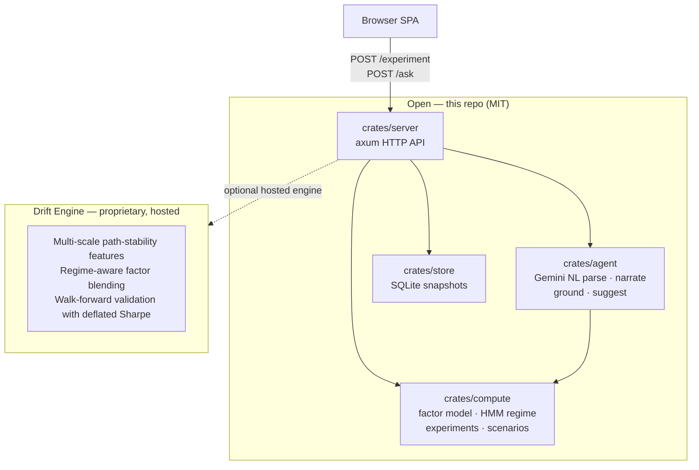

# Drift

**Institutional-grade quantitative risk research for Indian equities — every number comes with its evidence trail.**

[](https://github.com/samvardhan03/Drift/actions/workflows/ci.yml)
[](LICENSE)
[](https://www.rust-lang.org/)
[](#)

---

<!-- TODO: add a GIF of the UI (record with LICEcap or Kap against a local server run: type a question in /ask, watch the EvidenceTrace render, click Download PDF). See PR manual to-dos. -->
<!-- TODO: add a sample PDF screenshot (GET /report/:id after running an experiment locally). -->

---

## 60-second quickstart

**With Docker (no keys needed — compute-only mode):**

```bash
docker build -t drift .
docker run -p 8080:8080 drift
# Open http://localhost:8080
```

`/experiment` returns a full `EvidenceTrace`. `/ask` returns 503 without a key.

**With AI narration:**

```bash
# Free key at https://aistudio.google.com/
docker run -p 8080:8080 -e GEMINI_API_KEY=your_key drift
```

**From source:**

```bash
git clone https://github.com/samvardhan03/Drift.git
cd Drift
SNAPSHOT_DB_PATH=./data/snapshots.db cargo run -p server --release
```

---

## Why Drift

| Claim | How it is enforced |
|---|---|
| **Evidence on every number** | `EvidenceTrace` records every intermediate value — factor scores, regime state, covariance — alongside the raw inputs that produced them |
| **Grounded AI narration** | Before the AI answer reaches you, a verbatim-number check confirms every figure in the text appears in the trace; mismatches trigger an automatic re-prompt |
| **Lookahead-safe** | HMM regime labels and factor scores use only data available at the point being evaluated; enforced structurally, not by convention |
| **Rust speed** | No GIL, no interpreter overhead; compute runs in a blocking thread pool so the async server stays responsive |
| **India-first** | NSE universes, INR formatting, three Indian stress scenarios (IL&FS, COVID crash, taper tantrum), Yahoo Finance with NSE calendar alignment |

---

## Architecture



### Request lifecycle

```
POST /experiment
  validate portfolio → fetch Yahoo OHLCV (cached CSV) → fit factor model
  → 3-state HMM regime → run experiment → EvidenceTrace (JSON + SQLite)

POST /ask  (needs GEMINI_API_KEY)
  NL → Experiment (Gemini function-calling) → same compute path
  → Gemini narration → grounding check (retry if numbers mismatch) → PipelineResult
```

---

## Open vs. Drift Engine

| Capability | Open (this repo) | Drift Engine (hosted) |
|---|---|---|
| Factor risk model (OLS + Ledoit-Wolf shrinkage) | Yes | Yes |
| 3-state HMM regime detection | Yes | Yes |
| FactorShock / RiskDecomposition | Yes | Yes |
| CVaR rebalance (Rockafellar-Uryasev LP) | Yes | Yes |
| RiskDrift baseline comparisons | Yes | Yes |
| Reverse stress test | Yes | Yes |
| Policy check | Yes | Yes |
| NL queries via Gemini | Yes | Yes |
| PDF report generation | Yes | Yes |
| Multi-scale path-stability features | — | Yes |
| Regime-aware factor blending | — | Yes |
| Walk-forward validation with deflated Sharpe | — | Yes |
| Data vendor: Yahoo Finance | Yes | Yes |
| Data vendors: Zerodha Kite, BharatStock | — | Yes |

**[Get Drift Engine access →](https://github.com/samvardhan03/Drift/discussions)** *(waitlist link — add yours in the PR body)*

---

## Examples

```bash
# FactorShock — how exposed am I to a factor move?
curl -X POST http://localhost:8080/experiment \
  -H "Content-Type: application/json" \
  -d @crates/compute/examples/factor_shock_nifty10.json

# RiskDecomposition — where does my risk come from?
curl -X POST http://localhost:8080/experiment \
  -H "Content-Type: application/json" \
  -d @crates/compute/examples/risk_decomposition_nifty10.json

# CVaR rebalance — what weights minimise tail risk?
curl -X POST http://localhost:8080/experiment \
  -H "Content-Type: application/json" \
  -d @crates/compute/examples/cvar_rebalance_nifty10.json

# Natural language (requires GEMINI_API_KEY)
curl -X POST http://localhost:8080/ask \
  -H "Content-Type: application/json" \
  -d '{
    "portfolio": {
      "holdings": [
        {"ticker": "RELIANCE.NS", "weight": 0.25},
        {"ticker": "TCS.NS",      "weight": 0.25},
        {"ticker": "HDFCBANK.NS", "weight": 0.25},
        {"ticker": "INFY.NS",     "weight": 0.25}
      ]
    },
    "message": "Where is my risk concentrated, and what does the current regime say?"
  }'
```

All example portfolios use NSE tickers and Yahoo Finance — no paid data vendor required.

---

## Historical stress scenarios

Three India-specific scenarios ship at `GET /scenarios`:

| Scenario | Period | Description |
|---|---|---|
| COVID Crash | Mar 2020 | Sharp broad-market sell-off |
| IL&FS Contagion | Sep–Oct 2018 | Credit crisis, NBFC and financials led |
| Taper Tantrum | May–Aug 2013 | EM capital flight on Fed taper signal |

---

## Docs

- [Architecture](docs/architecture.md)
- [Deployment guide](docs/deploy.md) — Docker, Cloud Run, Fly.io
- [FAQ](docs/faq.md)

---

## Roadmap (open-core)

- [ ] Demo GIF in README
- [ ] WebSocket streaming for long-running experiments
- [ ] Nifty 50 / Bank Nifty / Nifty Midcap 100 universe presets
- [ ] `cargo-deny` in CI (currently `cargo-audit`)
- [ ] Rust CLI end-to-end example

---

## Contributing

See [CONTRIBUTING.md](CONTRIBUTING.md). All PRs must pass `cargo fmt --check`, `cargo clippy -D warnings`, and `cargo test --workspace`. Proprietary engine code, formulas, and constants must not be introduced.

---

## Citation

```bibtex
@software{drift2025,
  author = {Drift contributors},
  title  = {Drift: open-core quantitative risk research for Indian equities},
  year   = {2025},
  url    = {https://github.com/samvardhan03/Drift}
}
```

---

## License

New code in this repository is dual-licensed under **MIT OR Apache-2.0**. The `drift-risk-copilot` workspace (merged from [elli0t-yash/drift-risk-copilot](https://github.com/elli0t-yash/drift-risk-copilot)) retains its original **MIT** license; see [LICENSE](LICENSE).

The Drift Engine is proprietary and not included in this repository. See [NOTICE](NOTICE).

---

## Disclaimer

Drift is a research tool. It does not constitute investment advice, financial advice, or any regulated financial service. The maintainers are not SEBI-registered investment advisers. Any results are for informational purposes only. You are solely responsible for your investment decisions. Past performance does not guarantee future results.
