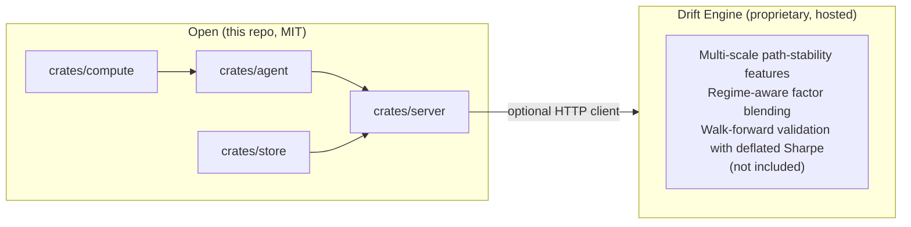

# Architecture

## Crate map

```
crates/
  compute/   Pure Rust analytics — no I/O in the hot path
  agent/     NL→Experiment→EvidenceTrace→narration (Gemini)
  server/    axum HTTP API + embedded SPA
  store/     SQLite snapshot store (rusqlite bundled)
```

## Request lifecycle

```
POST /experiment
  │
  ├─ validate: Portfolio (tickers, weights, weights sum to 1)
  ├─ deserialise: Experiment enum
  │
  ├─ compute::dispatch::run_experiment
  │     ├─ fetch: Yahoo Finance OHLCV (cached CSV, NSE-calendar aligned)
  │     ├─ fit:   OLS factor model, Ledoit-Wolf covariance, 3-state HMM regime
  │     └─ run:   FactorShock / RiskDecomposition / CvarRebalance / RiskDrift /
  │               ReverseStress / PolicyCheck
  │
  └─ EvidenceTrace (every number traceable to inputs)
       ├─ stored in SnapshotStore (for /drift baseline diffs)
       └─ returned as JSON  (or rendered to PDF via /report/:id)

POST /ask  (requires GEMINI_API_KEY)
  │
  ├─ agent::parse      NL → Experiment (Gemini function-calling)
  ├─ compute::dispatch (same path as /experiment above)
  ├─ agent::narrate    EvidenceTrace → plain English (Gemini)
  ├─ agent::grounding  verbatim-number check (retry if mismatch)
  └─ agent::suggest    proactive follow-up question
```

## Evidence trace

Every experiment returns an `EvidenceTrace` — a structured JSON object that records:

- the raw input (tickers, weights, dates)
- intermediate computed values (factor scores, regime state, covariance matrix)
- the final result (risk attribution, optimised weights, stress P&L)

The AI narration step is **verified**: before the narration reaches the user, the grounding check confirms that every number mentioned in the text appears verbatim in the trace. If it does not, Gemini is re-prompted (up to 2 retries).

## Open vs. proprietary boundary



The `compute` crate uses Yahoo Finance for market data. The Drift Engine (not in this repo) provides additional alpha features available via the hosted service.
